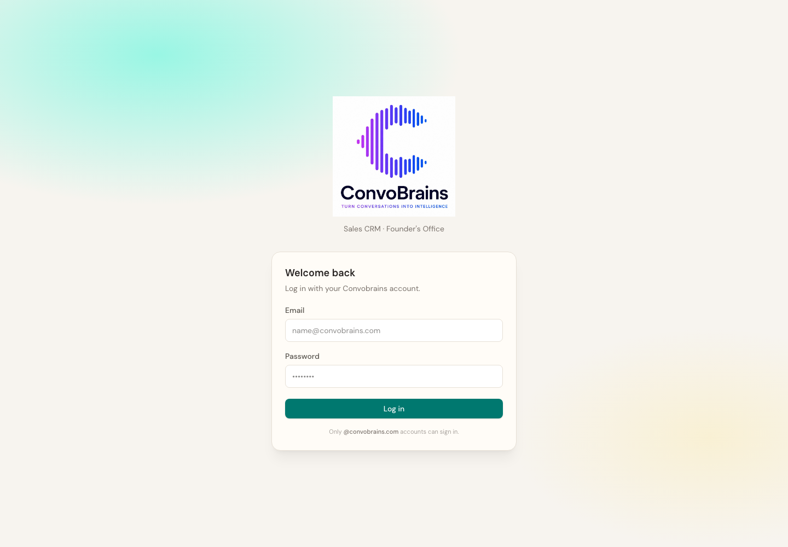

# Zero Cost CRM

[](https://www.codetriage.com/convobrains/zero-cost-crm)

**We don't need Salesforce. We need to know which SDR is converting and why.**

Most early-stage B2B teams hire their first SDR and manage them on Google Sheets,
scattered call recordings, and founder intuition. We built the system we wished existed.

[Run locally](#run-it-in-3-steps) · [Architecture](docs/ARCHITECTURE.md) · [API](docs/API.md) · [Contributing](CONTRIBUTING.md) · [Security](SECURITY.md) · **[Book a demo](https://www.convobrains.com/contact)**



---

## Why this exists

We're a small team. Paying enterprise CRM prices for three reps is absurd.

We needed:

1. A **13-stage pipeline** we actually use
2. Visibility into **who is working** (logins, active time, outcomes)
3. **Follow-up discipline** — connected calls without a next step light up as alerts
4. **Call recordings** attached to contacts, not buried in Drive folders
5. Something a founder can stand up in **one command**

This repo is **Zero Cost CRM**: pipeline operations for founder-led sales teams.

[ConvoBrains](https://www.convobrains.com) is the **intelligence layer**: conversation analysis for call quality, pitch effectiveness, and objection handling.

> Zero Cost CRM tells you **what** happened.
>
> ConvoBrains tells you **why** it happened.

---

## Run it in 3 steps

Requires [Docker](https://docs.docker.com/get-docker/) and Node.js 22+.

```bash
git clone https://github.com/ConvoBrains/zero-cost-crm.git
cd zero-cost-crm
make setup && make dev
```

Open **[localhost:5173](http://localhost:5173)** and sign in:

```text
Email:    founder.seed@convobrains.com
Password: TestSeed123!
```

This is a **demo seed account** with 3 days of sample SDR activity. It never touches production.

Want conversation intelligence on your own calls? [Book 15 min with us](https://www.convobrains.com/contact).

`make setup` installs dependencies, starts an isolated Postgres container, applies the schema, and loads companies, contacts, and three days of SDR activity.

```bash
make reset-demo   # wipe & reseed local demo data
```

### Environment

```bash
cp .env.example .env.local          # production-style local API
cp testing/functional/.env.testing.example testing/functional/.env.testing  # demo path (make setup does this)
```

Important variables (see [`.env.example`](.env.example)):

| Variable | Purpose |
| -------- | ------- |
| `DATABASE_URL` | Postgres connection string |
| `JWT_SECRET` | **Required** — long random secret |
| `ALLOWED_EMAIL_DOMAIN` | Login allow-list (`convobrains.com`, comma list, or `*` for any) |
| `CORS_ORIGINS` | Allowed browser origins (comma-separated) |
| `AWS_*` | Optional — required only for call-recording uploads |

---

## Is this for you?

Use this if you:

- Have **1–10 SDRs** and no Salesforce admin
- Still live in **Sheets / Notion / WhatsApp** for deal tracking
- Care more about **daily activity + call discipline** than forecasting modules
- Want **self-hosted** data and an open codebase

Skip it if you need enterprise CPQ, multi-currency ERP integrations, or a full marketing automation suite.

---

## What's in Zero Cost CRM

| Capability            | What you get                                         |
| --------------------- | ---------------------------------------------------- |
| **Live dashboard**    | Follow-ups due, demos, active opps, won/lost         |
| **13-stage pipeline** | Drag deals from lead → closed                        |
| **Contacts**          | Champions, statuses, notes, LinkedIn                 |
| **Paste import**      | Excel / Sheets / CSV → deduped companies + contacts  |
| **Call recordings**   | Upload & play audio per contact (S3 optional)        |
| **SDR activity**      | Logins, active/idle time, outcomes, targets          |
| **Manager alerts**    | No login by 10:30, zero connects, missing follow-ups |
| **Roles**             | Founder / admin / SDR                                |
| **Self-hosted**       | Your Postgres, your rules                            |

---

## The SDR operating model

### Daily rhythm

1. **Morning brief** — open the dashboard; clear follow-ups due today
2. **Pipeline** — move cards only when the stage actually changed
3. **Contacts** — update status after every dial
4. **Record** — attach the call when it mattered
5. **Activity** (managers) — check who worked, who coasted, who needs coaching

### The 13-stage pipeline

```text
Lead Added
  → Discovery Call Done
  → Follow-up
  → Demo Scheduled
  → Demo Delivered
  → Commercial Proposal Shared
  → POC Kickoff
  → Client Data Received
  → POC Delivered
  → Final Negotiation
  → Closed Won | Closed Lost | Not Interested
```

### Targets (editable in Activity)

| Metric          | Default |
| --------------- | ------- |
| Calls made      | 80      |
| Follow-ups set  | 25      |
| Demos scheduled | 4       |

---

## Stack

```text
React 19 + TypeScript + Tailwind
              ↓
        Express 5 API
              ↓
          PostgreSQL 16
              ↓
     S3 (optional call recordings)
```

AWS is only required when testing uploads. Activity, pipeline, and import work without it.

Schema is applied from [`sql/schema.sql`](sql/schema.sql) (idempotent). See [docs/ARCHITECTURE.md](docs/ARCHITECTURE.md).

---

## Commands

| Command           | What it does                        |
| ----------------- | ----------------------------------- |
| `make setup`      | Install, provision, migrate, seed   |
| `make dev`        | Web + API against the local demo DB |
| `make reset-demo` | Rebuild demo fixtures               |
| `make lint`       | Static checks                       |
| `make build`      | Production build                    |
| `make test`       | Unit tests                          |
| `make test-api`   | API functional tests (DB prepared)  |
| `make help`       | All targets                         |

---

## Import leads

1. Open **Import Leads**
2. Paste from Excel, Sheets, or CSV — or upload `.csv` / `.xlsx`
3. Columns: `Company · Prospect Name · Job Title · Email · Phone · Location · Employees · Industry`
4. Import — companies create/update; duplicate emails skip

Samples in the UI use synthetic `@*.example` data only.

---

## Deploy

**Vercel + PostgreSQL**

1. Import the repo in Vercel.
2. Set `DATABASE_URL`, `JWT_SECRET`, `ALLOWED_EMAIL_DOMAIN`, and optional AWS / `CORS_ORIGINS`.
3. `DATABASE_URL='postgresql://…' npm run db:migrate`
4. Deploy and hit `/api/health`.

**Docker / VPS**

```bash
# create .env with production secrets (never commit it)
make docker-build
make docker-up
make health
```

Root `docker-compose.yml` runs the app container; Postgres is external (managed DB or your own). Local demo Postgres is provided by `testing/functional/docker-compose.yml` via `make setup`.

---

## Security

- Do **not** ship demo credentials or `testing/functional/.env.testing` to production.
- Use a strong unique `JWT_SECRET`, verified TLS for Postgres, configured `CORS_ORIGINS`, and private object storage.
- Report vulnerabilities privately — see [SECURITY.md](SECURITY.md).

**If you ever committed real secrets to git:** rotate them immediately. History rewrite does not protect prior clones or forks.

---

## Branding & trademarks

MIT covers the **code**. The ConvoBrains name, logo, and marketing assets in `public/` remain ConvoBrains trademarks. Forks may keep attribution or replace branding; do not imply official endorsement.

Google Fonts (DM Sans, Instrument Serif) are loaded from Google’s CDN under their respective OFL licenses. See [NOTICE](NOTICE).

---

## Contributing

[Good first issues](https://github.com/ConvoBrains/zero-cost-crm/issues?q=is%3Aissue+is%3Aopen+label%3A%22good+first+issue%22) · [CONTRIBUTING.md](CONTRIBUTING.md) · [CONTRIBUTORS.md](CONTRIBUTORS.md) · [CodeTriage](https://www.codetriage.com/convobrains/zero-cost-crm)

```bash
make setup && make dev
npm test
```

---

## License

[MIT](LICENSE) © 2026 ConvoBrains

---

**Built by [ConvoBrains](https://www.convobrains.com)**  
*Turn conversations into intelligence.*

[Book a demo](https://www.convobrains.com/contact) · [support@convobrains.com](mailto:support@convobrains.com) · [LinkedIn](https://www.linkedin.com/company/convobrains/)
